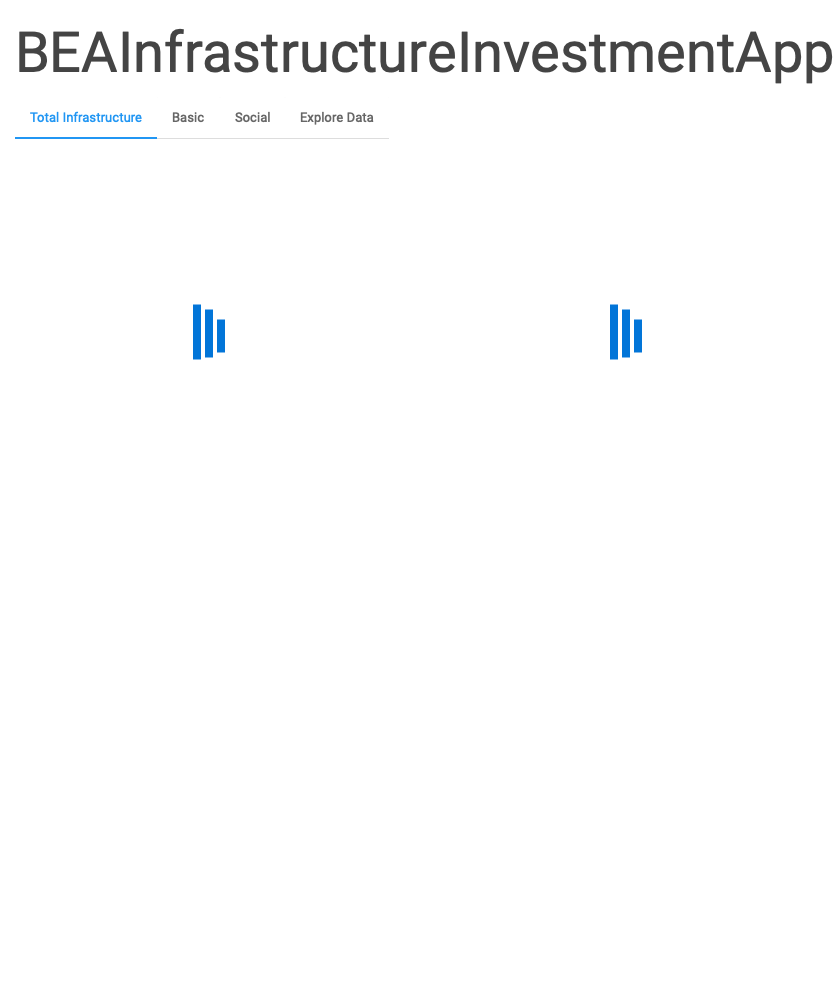

<!-- README.md is generated from README.Rmd. Please edit that file -->

# BEAInfrastructureInvestmentApp

<!-- badges: start -->

[](https://lifecycle.r-lib.org/articles/stages.html#experimental)
[](https://github.com/jpdugo/BEAInfrastructureInvestmentApp/actions)
<!-- badges: end -->

The goal of BEAInfrastructureInvestmentApp is to explore BEA
infrastructure investment datasets from tidytuesday.

## Installation

You can install the development version of
BEAInfrastructureInvestmentApp like so:

``` r
devtools::install_github('jpdugo/BEAInfrastructureInvestmentApp')
```

## Example

This is a basic example which shows you how to solve a common problem:

``` r
library(BEAInfrastructureInvestmentApp)
## run the app
BEAInfrastructureInvestmentApp::run_app()
#> Loading required package: shiny
#> 
#> Listening on http://127.0.0.1:7246
#> Warning: Transformation introduced infinite values in continuous y-axis
```


